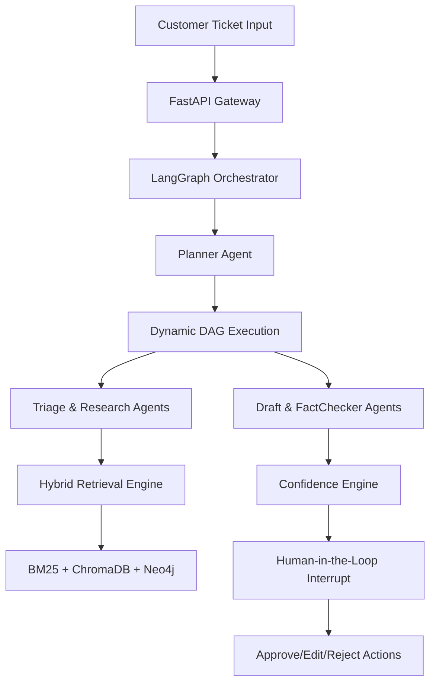
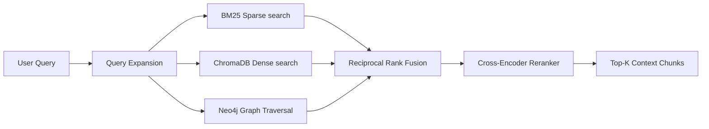
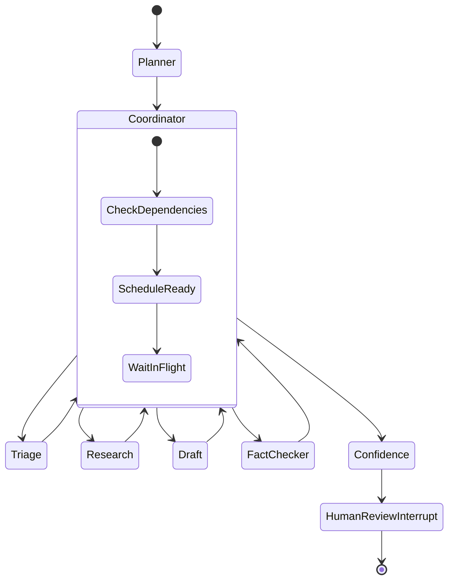
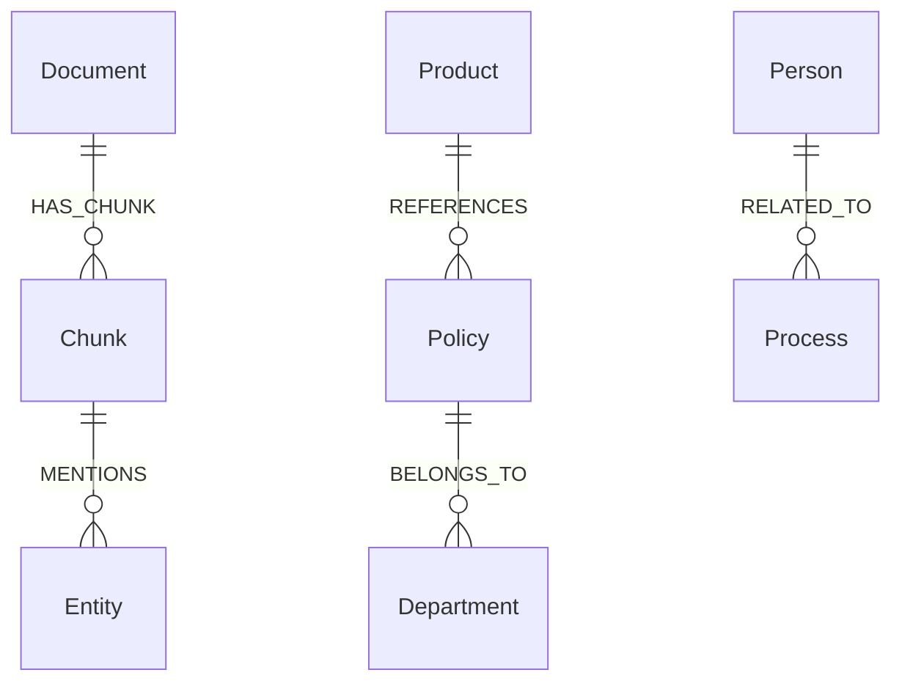
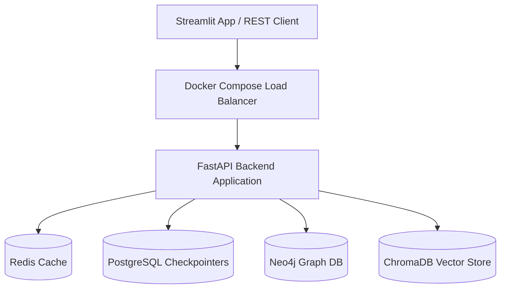

# 🤖 Autonomous Business Operations Copilot

An enterprise-grade Multi-Agent Orchestrator and GraphRAG platform powered by Google Gemini and LangGraph.

---

## 🏛️ System Architecture



---

## 🔍 Retrieval Pipeline Architecture



---

## ⛓️ LangGraph Workflow DAG Transitions



---

## 🕸️ Knowledge Graph Schema



---

## 📦 Deployment Architecture



---

## 🚀 Key Features
- **Dynamic DAG Routing**: Planner agent maps ticket requirements to task lists dynamically.
- **Pluggable SQLite Cache**: EmbeddingService avoids redundant SentenceTransformer calls.
- **Explainability Timeline**: Traces reasoning steps and citation references on the dashboard.
- **Ragas/DeepEval Quality Evaluation**: Automated suite calculating normalized edit distance and groundedness scores.

---

## 🛠️ Technology Stack
- **AI Core**: Google Gemini API, sentence-transformers.
- **Orchestration**: LangGraph, Pydantic v2.
- **Databases**: Neo4j Community, ChromaDB, SQLite/Postgres.
- **Dashboard**: Streamlit, Plotly, Pyvis.
- **CI/CD & Scanning**: GitHub Actions, Ruff, Black, Mypy, Pytest.

---

## 📁 Project Directory Structure
```
├── .github/workflows/          # CI/CD pipelines
├── configs/                    # Settings & prompts configurations
├── docs/                       # Architectural guides
├── evaluation/                 # Regression golden dataset JSONs
├── frontend/                   # Multi-page Streamlit dashboards
├── reports/                    # Tabular benchmark summaries
├── scripts/                    # Neo4j setup and runner commands
├── src/                        # Core codebase package
└── tests/                      # Pytest unit suites
```

---

## 📄 Documentation Directory

Detailed implementation guides and developer resources:
- 🚀 **[API Documentation](docs/api_documentation.md)**: REST routing schemas and requests.
- ⚙️ **[Developer Setup Guide](docs/developer_guide.md)**: Local configurations and testing commands.
- 🐳 **[Deployment Guide](docs/deployment_guide.md)**: Docker Compose and production environments.
- 🏛️ **[Architectural Decisions](docs/architecture_decisions.md)**: Technology selections rationales.
- ⚡ **[Benchmark Guide](docs/benchmark_guide.md)**: Throughput loads check setups.
- 🏆 **[Evaluation Guide](docs/evaluation_guide.md)**: Quality scoring and Groundedness.
- 🛠️ **[Troubleshooting Guide](docs/troubleshooting_guide.md)**: System error resolutions.
- 💼 **[Resume Description](docs/resume_description.md)**: Bullet points highlighting project outcomes.
- 💬 **[Interview Q&A Guide](docs/interview_questions.md)**: Pre-compiled design interview guides.
- 📈 **[Product Roadmap](docs/roadmap.md)**: Current capacity limitations and roadmaps.

---

## ⏱️ Benchmark Summary (Phase 7 results)
- **Avg GraphRAG Quality score**: `94.4%` (Semantic Faithfulness)
- **Avg Processing Latency**: `5.2 seconds`
- **Estimated operational token cost**: `$0.021 USD` per ticket


---

## ⚙️ Quick Start Guide
1. Launch docker database containers:
   ```bash
   docker-compose up -d
   ```
2. Initialize python environments:
   ```bash
   python -m venv venv
   source venv/bin/activate
   pip install -r requirements.txt -r requirements-dev.txt
   ```
3. Seed Neo4j graph rules:
   ```bash
   python scripts/setup_neo4j.py
   ```
4. Start the Streamlit application:
   ```bash
   streamlit run frontend/app.py
   ```

---

## 🎥 Recording & Updating Demo GIFs
Placeholders for UI demonstration animations are saved under:
- `docs/assets/dashboard.gif`
- `docs/assets/retrieval.gif`
- `docs/assets/workflow.gif`
- `docs/assets/graph.gif`

To update these animations:
1. Fire up the local Streamlit application.
2. Use a screen recorder tool (e.g. OBS Studio or ScreenToGif) to record the interaction loops.
3. Save or export the output files under `docs/assets/` using the matching filenames to hot-reload the README attachments.

---

## 🛡️ License
Licensed under the Apache-2.0 LICENSE guidelines.
