# Autonomous Business Operations Copilot — Architecture Design

> **Phase 1: Architecture Analysis, Design & Improvement**
> A GraphRAG-powered Enterprise Multi-Agent AI System with Human-in-the-Loop Review, Explainability, Long-Term Memory, and Business Intelligence.

---

## Executive Summary

This document presents the complete architecture for an enterprise-grade AI platform that goes far beyond a chatbot or hackathon demo. The system automates business operations (ticket triage, customer support, policy lookup, knowledge retrieval, response drafting, reporting) while maintaining **absolute human control** — no action executes without approval.

The architecture is designed to maximize **interview value** and **technical depth** by demonstrating mastery of: GraphRAG, hybrid retrieval, multi-agent orchestration, dynamic planning, parallel execution, human-in-the-loop workflows, long-term memory, explainability, confidence scoring, evaluation pipelines, and enterprise security.

> [!IMPORTANT]
> **This is a complete rebuild.** The existing project (Multi-Agent Data Analyst for CSV analysis) is a fundamentally different system. The new project will be built from scratch in a new directory structure within this workspace, preserving the existing project as a reference.

---

## System Architecture

### High-Level Architecture Diagram

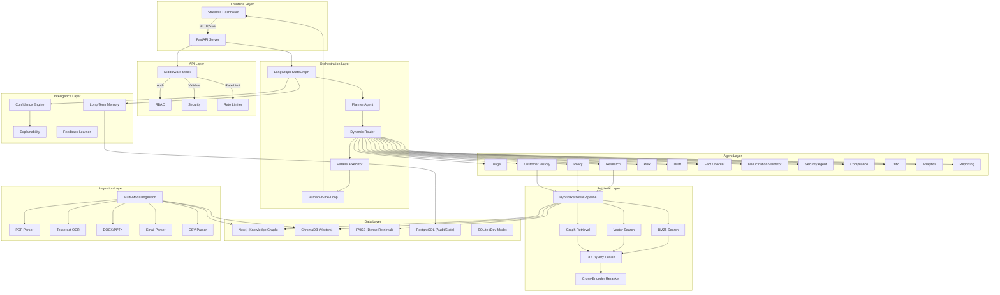

### Request Lifecycle — End-to-End Flow

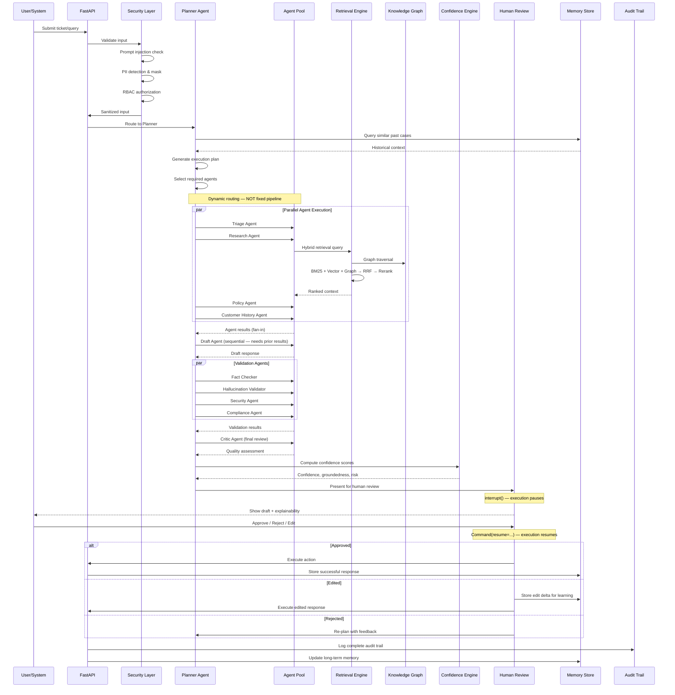

---

## Weakness Analysis of Original Specification

I identified the following weaknesses and gaps in the original spec before designing the final architecture:

| # | Weakness | Impact | Resolution |
|---|----------|--------|------------|
| 1 | **No Observability/Tracing** | Cannot debug agent decisions, track latency, or identify bottlenecks | Added Langfuse/OpenTelemetry integration layer |
| 2 | **No Caching Strategy** | Redundant LLM calls for similar queries waste cost and time | Added semantic response cache with TTL |
| 3 | **No Circuit Breaker** | Single LLM API failure cascades to total system failure | Added circuit breaker per agent with fallback strategies |
| 4 | **No Cost Tracking** | Cannot measure ROI or optimize spend | Added per-request token/cost tracking engine |
| 5 | **No Rate Limiting** | API abuse and LLM rate limit violations | Added middleware rate limiting + LLM call throttling |
| 6 | **No Error Recovery** | Agent failure mid-pipeline loses all progress | LangGraph checkpointer enables resume from last checkpoint |
| 7 | **No Schema Validation for KG** | Entity types drift into inconsistent labels | Added schema-guided extraction with controlled vocabularies |
| 8 | **No Incremental Ingestion** | Adding new docs requires full knowledge graph rebuild | Added incremental ingestion with change detection |
| 9 | **No Prompt Registry** | Prompt changes are unversioned, untestable | Added versioned prompt registry with A/B testing support |
| 10 | **No Health Checks** | Cannot monitor dependency availability | Added health endpoints for Neo4j, Postgres, ChromaDB, LLM API |
| 11 | **Missing Graceful Degradation** | No fallback when specialized agents fail | Added degradation strategies (skip non-critical agents, use cached responses) |
| 12 | **FAISS + ChromaDB overlap** | Both are vector stores — unclear when to use which | Clarified roles: ChromaDB for metadata-filtered search, FAISS for high-speed bulk retrieval |

---

## Additional Enterprise Features (Beyond Original Spec)

> [!TIP]
> These additions significantly increase interview value by demonstrating production-thinking beyond academic implementations.

### 1. Observability & Distributed Tracing
- **Langfuse** integration for full LLM call tracing (prompt, completion, tokens, latency, cost)
- Structured logging with correlation IDs across all agents
- Dashboard showing agent execution graphs in real-time

### 2. Cost Tracking Engine
- Per-request token counting (input/output) for Gemini API
- Cost estimation per ticket processing
- Monthly cost projections and optimization suggestions
- ROI calculation: (manual_cost - automated_cost) / manual_cost

### 3. Circuit Breaker Pattern
- Per-agent circuit breakers (closed → open → half-open)
- Configurable failure thresholds and recovery timeouts
- Fallback strategies: cached response, skip agent, use simpler model

### 4. Semantic Response Cache
- Cache LLM responses keyed by semantic similarity (not exact match)
- Configurable TTL and cache invalidation on knowledge updates
- Cache hit rate metrics for optimization

### 5. Prompt Registry
- Versioned prompt templates stored in database
- A/B testing support: run different prompts for same agent, compare quality
- Prompt performance tracking (approval rate per prompt version)

### 6. Knowledge Graph Drift Detection
- Monitor for stale knowledge (documents older than configurable threshold)
- Detect contradictory facts across different sources
- Alert when entity relationships change significantly

### 7. Webhook System
- Configurable webhooks for ticket completion, escalation, SLA breach
- Integration with external systems (Slack, PagerDuty, Jira)

### 8. Multi-Tenant Namespace Isolation
- Business unit isolation for knowledge, memory, and analytics
- Configurable access policies per tenant

---

## Core Architecture Components

### 1. LangGraph Orchestration Engine

**Pattern: Supervisor/Planner with Command API + Send API**

The orchestration uses LangGraph's modern patterns:
- **`Command()` API** for dynamic agent routing (not conditional edges)
- **`Send()` API** for fan-out parallel agent execution
- **`interrupt()` / `Command(resume=...)`** for human-in-the-loop
- **Checkpointer** (PostgreSQL) for state persistence and crash recovery
- **Store** for cross-thread long-term memory

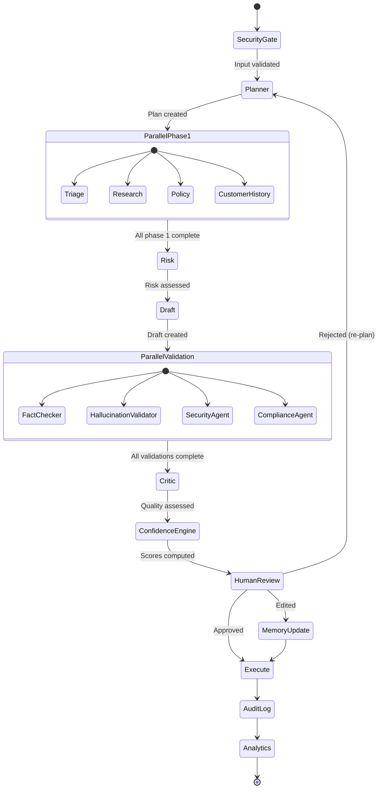

**State Schema Design** — Uses typed Pydantic models with LangGraph reducers:

```python
class CopilotState(TypedDict):
    # Input
    ticket: TicketInput
    
    # Planner
    execution_plan: ExecutionPlan
    active_agents: list[str]
    
    # Agent Results (reducer: merge dicts)
    agent_results: Annotated[dict[str, AgentResult], merge_dicts]
    
    # Retrieval
    retrieved_context: Annotated[list[RetrievalResult], operator.add]
    graph_traversal_path: list[GraphNode]
    
    # Draft
    draft_response: DraftResponse
    
    # Validation
    validation_results: Annotated[dict[str, ValidationResult], merge_dicts]
    
    # Confidence
    confidence_scores: ConfidenceScores
    
    # Human Review
    review_decision: ReviewDecision | None
    reviewer_feedback: str
    
    # Memory
    memory_context: list[MemoryEntry]
    
    # Audit
    audit_trail: Annotated[list[AuditEntry], operator.add]
    
    # Metadata
    trace_id: str
    timestamp: str
    status: str
```

### 2. GraphRAG Pipeline

**Architecture: LLM-based entity extraction → Neo4j knowledge graph → Leiden community detection → Hybrid retrieval**

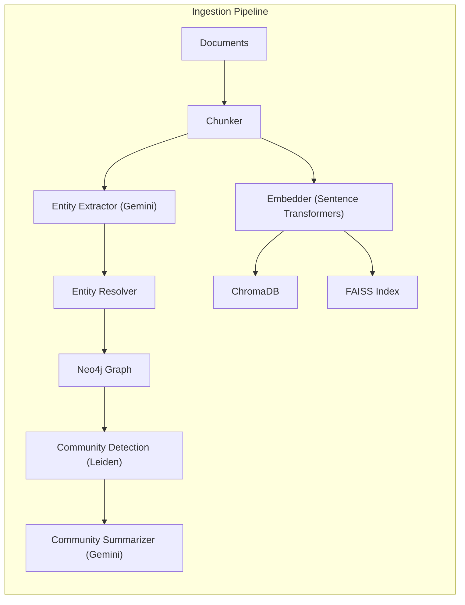

**Neo4j Knowledge Graph Schema:**

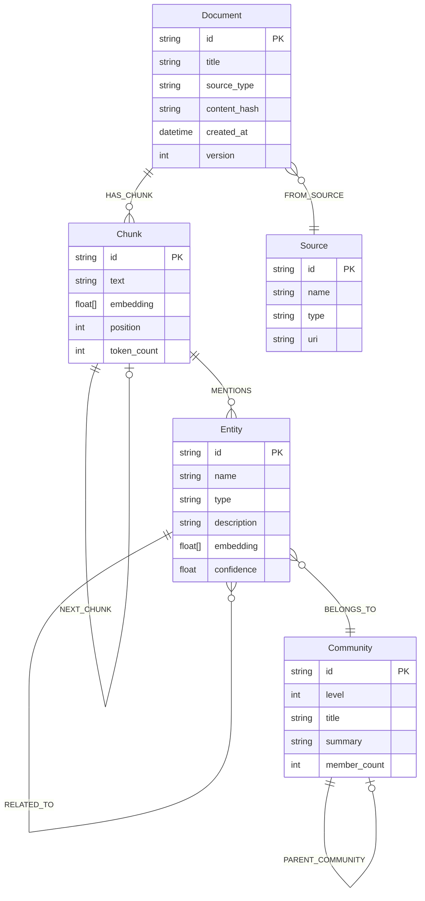

**Entity Types (Controlled Vocabulary for Schema-Guided Extraction):**

| Entity Type | Description | Examples |
|---|---|---|
| `PERSON` | Employee, customer, stakeholder | "Jane Smith", "CEO" |
| `ORGANIZATION` | Company, department, team | "Acme Corp", "Engineering" |
| `PRODUCT` | Product, service, feature | "CloudSync Pro", "API Gateway" |
| `POLICY` | Business policy, rule, SLA | "Refund Policy v3", "99.9% SLA" |
| `PROCESS` | Business process, workflow | "Ticket Escalation", "Onboarding" |
| `METRIC` | KPI, measurement | "CSAT Score", "Resolution Time" |
| `ISSUE_TYPE` | Ticket category, problem type | "Billing Dispute", "Access Request" |
| `TECHNOLOGY` | Tool, platform, system | "Salesforce", "AWS Lambda" |

### 3. Hybrid Retrieval Pipeline

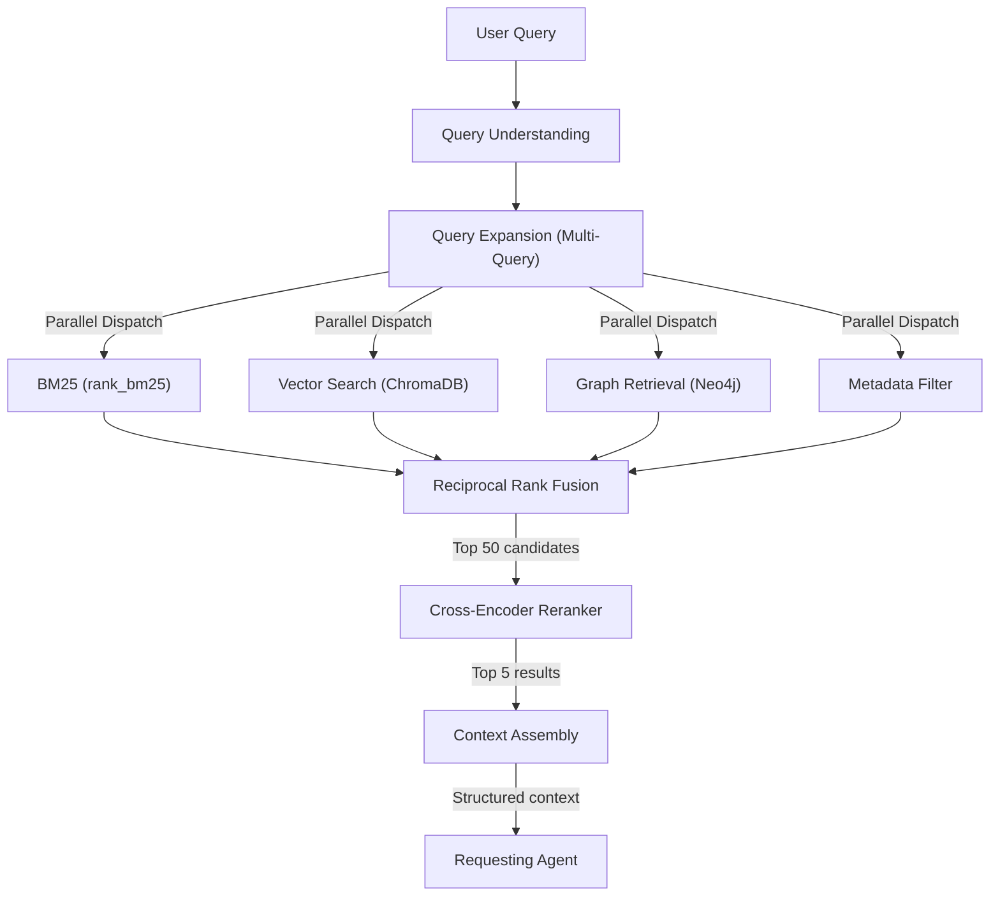

**Retrieval Strategy Selection:**

| Query Type | Primary Retrieval | Example |
|---|---|---|
| Factual lookup | BM25 + Vector | "What is the refund window?" |
| Multi-hop reasoning | Graph traversal | "Which policies affect premium customers in APAC?" |
| Global sensemaking | Community summaries | "What are the main complaint themes this quarter?" |
| Hybrid complex | All four signals | "Find relevant policies for this billing dispute with customer X" |

### 4. Open Knowledge Format (OKF)

Enterprise knowledge is structured as OKF bundles — directories of Markdown files with YAML frontmatter:

```
knowledge/
├── policies/
│   ├── refund-policy.md
│   ├── sla-agreements.md
│   ├── data-retention.md
│   └── escalation-policy.md
├── procedures/
│   ├── ticket-triage.md
│   ├── incident-response.md
│   └── customer-onboarding.md
├── entities/
│   ├── products/
│   │   ├── cloudsync-pro.md
│   │   └── api-gateway.md
│   └── departments/
│       ├── engineering.md
│       └── customer-success.md
└── metrics/
    ├── customer-satisfaction.md
    ├── resolution-time.md
    └── first-contact-resolution.md
```

**OKF File Structure:**
```yaml
---
type: policy                              # REQUIRED
title: "Standard Refund Policy"
description: "Governs all product refund requests"
version: "3.2"
effective_date: "2026-01-15"
department: "Customer Success"
tags: [billing, refund, customer-facing]
evidence:
  - uri: "gdrive://policies/refund-v3.pdf"
    type: "source_document"
  - uri: "jira://CS-4521"
    type: "approval_ticket"
relationships:
  - target: "../entities/products/cloudsync-pro.md"
    type: "applies_to"
  - target: "./escalation-policy.md"
    type: "escalates_to"
lineage:
  created_by: "legal-team"
  reviewed_by: "vp-customer-success"
  supersedes: "./refund-policy-v2.md"
---

## Standard Refund Policy

Customers may request a full refund within 30 days of purchase...

### Eligibility Criteria
- Product must be unused or defective
- Request must be submitted through official channels
...
```

### 5. Multi-Agent System Design

**Agent Architecture: Abstract Base → Specialized Implementations**

Every agent follows a consistent contract:

```python
class BaseAgent(ABC):
    """Abstract base for all specialized agents."""
    
    name: str
    description: str
    required_inputs: list[str]
    outputs: list[str]
    can_parallelize: bool
    
    @abstractmethod
    async def execute(self, state: CopilotState, config: AgentConfig) -> AgentResult:
        """Execute agent logic and return structured result."""
    
    @abstractmethod
    def get_confidence(self, result: AgentResult) -> float:
        """Self-assess confidence in the result."""
```

**Agent Dependency Graph & Parallelism:**

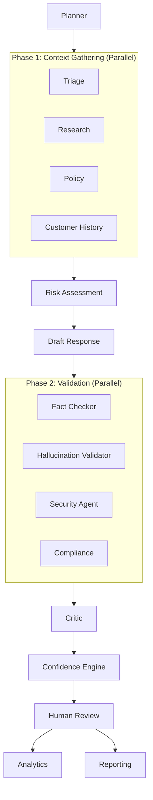

**Agent Specifications:**

| Agent | Inputs | Outputs | Parallelizable | LLM Required |
|-------|--------|---------|----------------|--------------|
| **Planner** | ticket, memory_context | execution_plan, active_agents | No (entry point) | Yes (Gemini) |
| **Triage** | ticket | category, priority, sentiment, urgency | Yes (Phase 1) | Yes |
| **Research** | ticket, execution_plan | retrieved_context, sources | Yes (Phase 1) | Yes + Retrieval |
| **Policy** | ticket, category | applicable_policies, constraints | Yes (Phase 1) | Yes + Retrieval |
| **Customer History** | customer_id | past_tickets, preferences, tier | Yes (Phase 1) | No (DB lookup) |
| **Risk** | agent_results | risk_level, risk_factors | No (needs Phase 1) | Yes |
| **Draft** | all_context | draft_response, citations | No (sequential) | Yes |
| **Fact Checker** | draft, sources | verified_claims, unverified_claims | Yes (Phase 2) | Yes |
| **Hallucination Validator** | draft, sources | hallucination_risk, flagged_passages | Yes (Phase 2) | Yes |
| **Security Agent** | draft, ticket | pii_detected, injection_risk | Yes (Phase 2) | No (rule-based) |
| **Compliance** | draft, policies | compliance_status, violations | Yes (Phase 2) | Yes |
| **Critic** | draft, validations | quality_score, improvement_suggestions | No (needs Phase 2) | Yes |
| **Analytics** | all_results | metrics, kpis | Post-execution | No (computation) |
| **Reporting** | all_results | formatted_report | Post-execution | Yes |

### 6. Confidence Engine

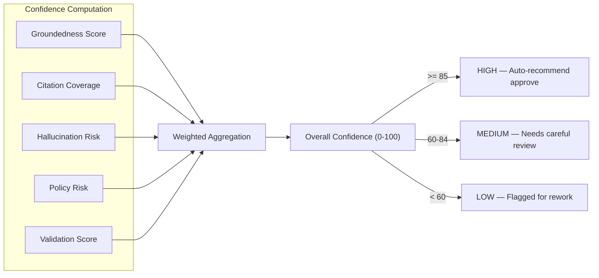

**Scoring Formula:**
```
confidence = (
    0.30 × groundedness_score +     # How well grounded in sources
    0.25 × citation_coverage +       # % of claims with citations
    0.20 × (1 - hallucination_risk) + # Inverse hallucination risk
    0.15 × policy_compliance +        # Policy adherence
    0.10 × validation_pass_rate       # Fact-check + compliance pass rate
)
```

### 7. Long-Term Memory Architecture

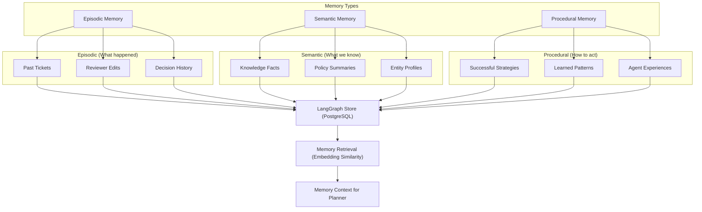

**Learning from Human Feedback Flow:**

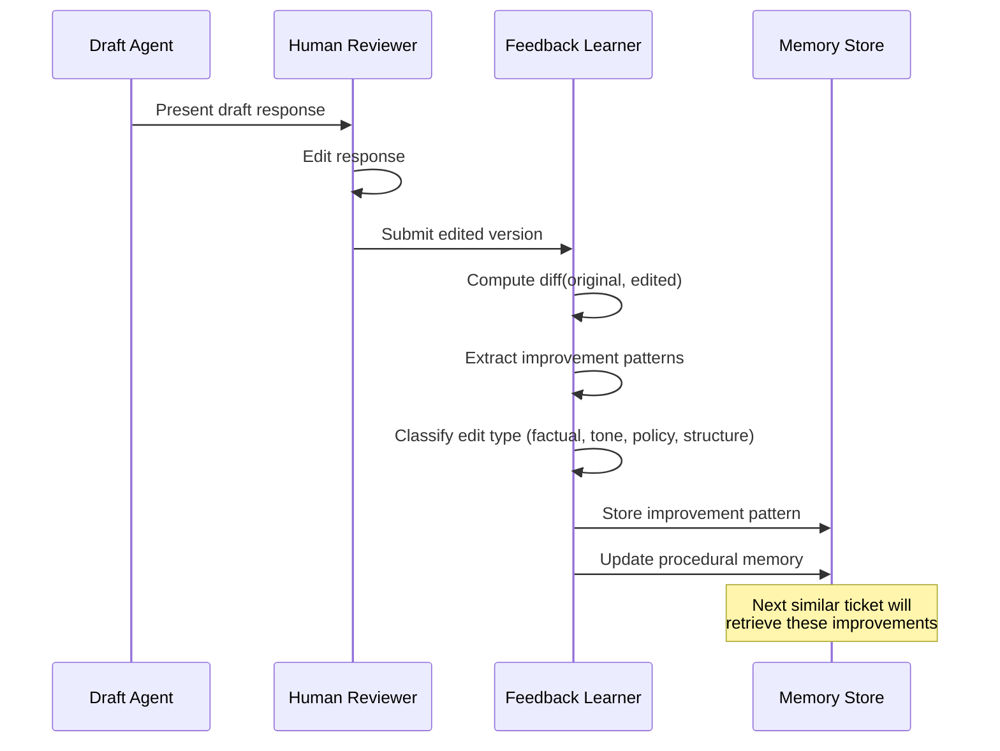

### 8. Human Review Dashboard

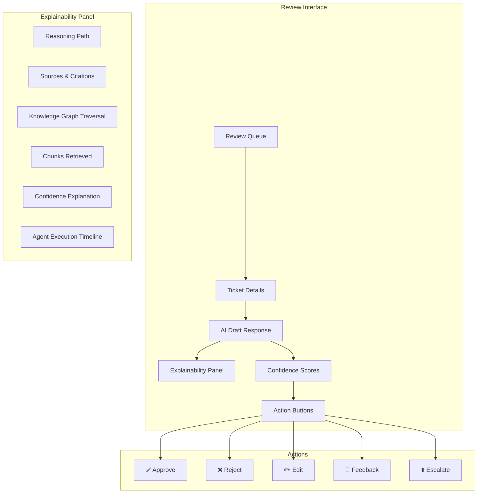

### 9. Evaluation Pipeline

**Dual-Framework Approach: RAGAS + DeepEval**

| Metric | Source | Description |
|--------|--------|-------------|
| **Faithfulness** | RAGAS | Are claims supported by retrieved context? |
| **Answer Relevance** | RAGAS | Does the answer address the question? |
| **Context Precision** | RAGAS | Are the retrieved contexts relevant? |
| **Context Recall** | RAGAS | Does retrieved context cover the ground truth? |
| **Hallucination** | DeepEval | Rate of unsupported claims |
| **Citation Accuracy** | Custom | Do citations point to correct sources? |
| **Latency (p50/p95/p99)** | Custom | End-to-end processing time |
| **Cost per Ticket** | Custom | Token usage × price per token |
| **Approval Rate** | Custom | % approved without edits |
| **Edit Distance** | Custom | Average diff between AI draft and approved version |

### 10. Benchmark Suite

**5-Way Comparison:**

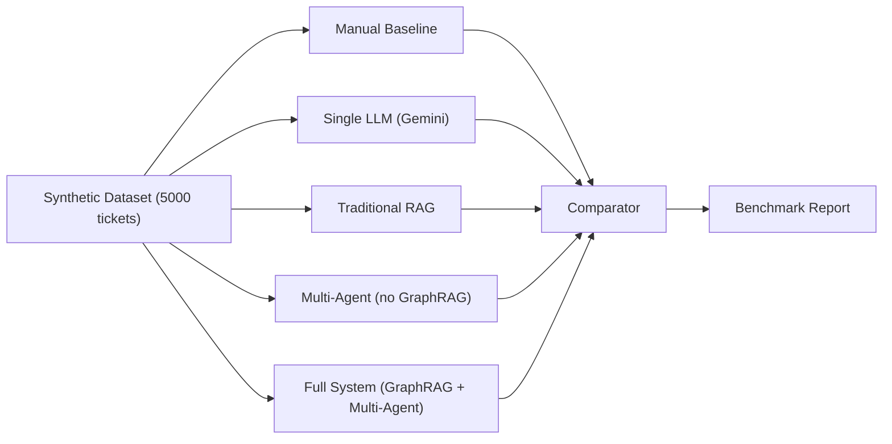

| Benchmark | What It Measures |
|-----------|-----------------|
| **Manual** | Human-only processing (baseline for time/cost) |
| **Single LLM** | Raw Gemini with full context (no agents, no retrieval) |
| **Traditional RAG** | Vector search + single LLM (no graph, no agents) |
| **Multi-Agent** | Full agent pipeline with vector RAG (no graph) |
| **GraphRAG Multi-Agent** | Full system — the complete platform |

---

## Project Structure

```
autonomous-biz-copilot/
├── README.md
├── pyproject.toml                    # Modern Python packaging
├── docker-compose.yml                # Neo4j, Postgres, ChromaDB
├── Dockerfile
├── Makefile                          # Common commands
├── .env.example
│
├── configs/
│   ├── settings.py                   # Pydantic Settings (env-aware)
│   ├── agents.yaml                   # Agent configurations
│   ├── retrieval.yaml                # Retrieval pipeline config
│   ├── prompts.yaml                  # Prompt registry
│   └── logging.yaml                  # Structured logging config
│
├── src/
│   ├── __init__.py
│   │
│   ├── api/                          # FastAPI Layer
│   │   ├── __init__.py
│   │   ├── main.py                   # App factory
│   │   ├── routers/
│   │   │   ├── tickets.py            # Ticket submission & processing
│   │   │   ├── review.py             # Human review endpoints
│   │   │   ├── analytics.py          # Analytics & reporting
│   │   │   ├── knowledge.py          # Knowledge management
│   │   │   └── health.py             # Health checks
│   │   ├── schemas/                  # Request/response Pydantic models
│   │   │   ├── ticket.py
│   │   │   ├── review.py
│   │   │   └── analytics.py
│   │   ├── middleware/
│   │   │   ├── auth.py               # Authentication
│   │   │   ├── rate_limit.py         # Rate limiting
│   │   │   └── cors.py               # CORS
│   │   └── dependencies.py          # DI container
│   │
│   ├── agents/                       # Multi-Agent System
│   │   ├── __init__.py
│   │   ├── base.py                   # BaseAgent ABC
│   │   ├── registry.py              # Agent registry & discovery
│   │   ├── planner.py               # Planner/Supervisor
│   │   ├── triage.py                # Classification & routing
│   │   ├── research.py             # Knowledge retrieval
│   │   ├── policy.py               # Policy lookup
│   │   ├── customer_history.py     # Customer context
│   │   ├── risk.py                 # Risk assessment
│   │   ├── draft.py                # Response generation
│   │   ├── fact_checker.py         # Fact verification
│   │   ├── hallucination.py        # Hallucination detection
│   │   ├── security_agent.py       # Security screening
│   │   ├── compliance.py           # Compliance checking
│   │   ├── critic.py               # Quality review
│   │   ├── analytics_agent.py      # Metrics computation
│   │   └── reporting.py            # Report generation
│   │
│   ├── orchestrator/                # LangGraph Engine
│   │   ├── __init__.py
│   │   ├── graph.py                 # Main StateGraph
│   │   ├── state.py                 # State schema + reducers
│   │   ├── nodes.py                 # Node wrappers
│   │   ├── routing.py              # Dynamic routing (Command API)
│   │   └── parallel.py             # Fan-out/fan-in (Send API)
│   │
│   ├── retrieval/                   # Hybrid Retrieval
│   │   ├── __init__.py
│   │   ├── pipeline.py             # Unified retrieval orchestrator
│   │   ├── vector_store.py         # ChromaDB + FAISS
│   │   ├── bm25.py                 # BM25 keyword search
│   │   ├── graph_retriever.py      # Neo4j graph retrieval
│   │   ├── reranker.py             # Cross-encoder re-ranking
│   │   ├── fusion.py               # Reciprocal Rank Fusion
│   │   ├── query_engine.py         # Query understanding & expansion
│   │   └── schemas.py              # Retrieval models
│   │
│   ├── knowledge_graph/            # GraphRAG Engine
│   │   ├── __init__.py
│   │   ├── builder.py              # Graph construction
│   │   ├── extractor.py            # Entity/relationship extraction
│   │   ├── resolver.py             # Entity resolution & dedup
│   │   ├── community.py            # Leiden community detection
│   │   ├── neo4j_client.py         # Neo4j connection manager
│   │   ├── traversal.py            # Graph traversal strategies
│   │   └── schemas.py              # Graph Pydantic models
│   │
│   ├── okf/                        # Open Knowledge Format
│   │   ├── __init__.py
│   │   ├── parser.py               # OKF Markdown parser
│   │   ├── builder.py              # OKF object builder
│   │   ├── versioning.py           # Git-based versioning
│   │   ├── lineage.py              # Document lineage
│   │   └── schemas.py              # OKF Pydantic models
│   │
│   ├── memory/                     # Long-Term Memory
│   │   ├── __init__.py
│   │   ├── store.py                # Memory store (LangGraph Store)
│   │   ├── feedback_learner.py     # Human edit learning
│   │   ├── experience.py           # Agent experience memory
│   │   └── schemas.py              # Memory models
│   │
│   ├── confidence/                 # Confidence Engine
│   │   ├── __init__.py
│   │   ├── engine.py               # Score computation
│   │   ├── groundedness.py         # Source grounding
│   │   ├── hallucination.py        # Hallucination risk
│   │   └── schemas.py
│   │
│   ├── explainability/             # Explainability Module
│   │   ├── __init__.py
│   │   ├── tracer.py               # Decision path tracing
│   │   ├── renderer.py             # Explanation rendering
│   │   └── schemas.py
│   │
│   ├── evaluation/                 # Eval Pipeline
│   │   ├── __init__.py
│   │   ├── pipeline.py             # Evaluation orchestrator
│   │   ├── metrics.py              # Custom metrics
│   │   ├── ragas_eval.py           # RAGAS integration
│   │   ├── deepeval_eval.py        # DeepEval integration
│   │   └── schemas.py
│   │
│   ├── benchmark/                  # Benchmark Suite
│   │   ├── __init__.py
│   │   ├── runner.py               # Benchmark orchestrator
│   │   ├── baselines.py            # Baseline implementations
│   │   ├── comparator.py           # Result comparison
│   │   └── report.py               # Report generator
│   │
│   ├── security/                   # Security Module
│   │   ├── __init__.py
│   │   ├── injection.py            # Prompt injection defense
│   │   ├── pii.py                  # PII detection & masking
│   │   ├── rbac.py                 # Role-based access
│   │   ├── validation.py           # Input validation
│   │   └── audit.py                # Audit trail
│   │
│   ├── tools/                      # Tool Calling
│   │   ├── __init__.py
│   │   ├── base.py                 # BaseTool interface
│   │   ├── registry.py             # Tool registry
│   │   ├── filesystem.py
│   │   ├── database.py
│   │   ├── email_tool.py
│   │   ├── slack.py
│   │   ├── notion.py
│   │   ├── gdrive.py
│   │   ├── github.py
│   │   └── calendar.py
│   │
│   ├── ingestion/                  # Multi-Modal Input
│   │   ├── __init__.py
│   │   ├── pipeline.py             # Ingestion orchestrator
│   │   ├── pdf.py
│   │   ├── ocr.py                  # Tesseract OCR
│   │   ├── docx.py
│   │   ├── pptx.py
│   │   ├── email_parser.py
│   │   ├── csv_parser.py
│   │   └── schemas.py
│   │
│   ├── database/                   # Database Layer
│   │   ├── __init__.py
│   │   ├── postgres.py             # PostgreSQL client
│   │   ├── sqlite_fallback.py      # SQLite for dev
│   │   ├── models.py               # SQLAlchemy models
│   │   └── migrations/             # Alembic migrations
│   │
│   ├── observability/              # Tracing & Monitoring
│   │   ├── __init__.py
│   │   ├── tracer.py               # Langfuse/OpenTelemetry
│   │   ├── cost_tracker.py         # Token & cost tracking
│   │   └── metrics.py              # Prometheus metrics
│   │
│   └── synthetic/                  # Synthetic Data Generator
│       ├── __init__.py
│       ├── generator.py            # Ticket generator
│       ├── templates.py            # Ticket templates
│       └── schemas.py
│
├── frontend/                       # Streamlit Dashboard
│   ├── app.py                      # Main entry point
│   ├── pages/
│   │   ├── 1_📥_Ticket_Inbox.py
│   │   ├── 2_🔍_Review_Dashboard.py
│   │   ├── 3_📊_Analytics.py
│   │   ├── 4_🧠_Knowledge_Graph.py
│   │   ├── 5_📈_Benchmarks.py
│   │   ├── 6_🔍_Explainability.py
│   │   └── 7_⚙️_Settings.py
│   └── components/
│       ├── sidebar.py
│       ├── metrics_cards.py
│       ├── confidence_gauge.py
│       ├── graph_viewer.py
│       └── timeline.py
│
├── knowledge/                      # OKF Knowledge Base
│   ├── policies/
│   ├── procedures/
│   ├── entities/
│   └── metrics/
│
├── tests/
│   ├── unit/
│   │   ├── test_agents/
│   │   ├── test_retrieval/
│   │   ├── test_knowledge_graph/
│   │   ├── test_confidence/
│   │   └── test_security/
│   ├── integration/
│   │   ├── test_pipeline.py
│   │   ├── test_retrieval_pipeline.py
│   │   └── test_graph_construction.py
│   └── e2e/
│       └── test_full_workflow.py
│
├── docs/
│   ├── architecture_decisions.md
│   ├── deployment_guide.md
│   ├── api_documentation.md
│   ├── developer_guide.md
│   ├── evaluation_guide.md
│   ├── benchmark_guide.md
│   ├── troubleshooting_guide.md
│   ├── resume_description.md
│   └── interview_questions.md
│
└── scripts/
    ├── setup_neo4j.py
    ├── seed_knowledge.py
    ├── generate_synthetic.py
    └── run_benchmarks.py
```

---

## Technology Stack — Justified Selections

| Component | Technology | Role |
|-----------|-----------|------|
| **LLM** | Gemini API (via `google-generativeai`) | Primary reasoning engine |
| **Orchestration** | LangGraph | Multi-agent state machine with HITL |
| **Agent Framework** | PydanticAI | Structured agent I/O validation |
| **Knowledge Graph** | Neo4j Community | Graph storage + native vector search |
| **Vector Store** | ChromaDB | Metadata-filtered vector search |
| **Dense Retrieval** | FAISS | High-speed bulk vector similarity |
| **Sparse Retrieval** | rank_bm25 | Keyword/lexical search |
| **Re-ranking** | sentence-transformers (cross-encoder) | Precision re-ranking |
| **Embeddings** | Sentence Transformers | Text → vector encoding |
| **Graph Analysis** | NetworkX + python-Leiden | Community detection, graph algorithms |
| **API** | FastAPI | Async REST API with SSE streaming |
| **Frontend** | Streamlit | Dashboard UI |
| **Relational DB** | PostgreSQL / SQLite | Audit trail, checkpoints, state |
| **Visualization** | Plotly | Interactive charts |
| **OCR** | Tesseract (pytesseract) | Image → text |
| **Evaluation** | RAGAS + DeepEval | RAG quality metrics |
| **Containerization** | Docker + docker-compose | Reproducible deployment |
| **Data Validation** | Pydantic v2 | Schema enforcement everywhere |
| **Async** | asyncio + httpx | Non-blocking I/O |

---

## Data Model — Entity Relationship Diagram

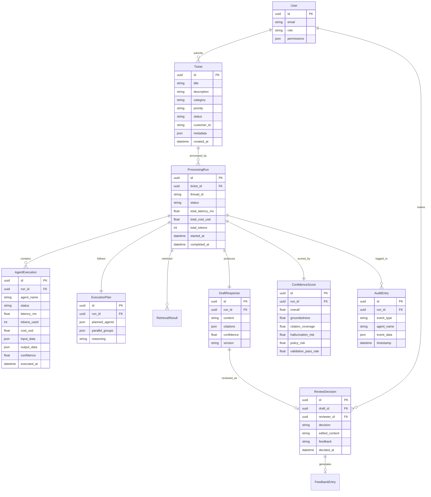

---

## Implementation Phases

> [!IMPORTANT]
> The build will proceed in 7 phases, each producing a working increment. This ensures the system is demonstrable at every stage.

### Phase 2: Foundation (Core Infrastructure)
- Project scaffolding, `pyproject.toml`, configs, settings
- Database layer (PostgreSQL/SQLite models, Alembic migrations)
- Pydantic schemas for all core domain objects
- FastAPI app factory with middleware stack
- Docker Compose (Neo4j, Postgres)
- Security module (input validation, PII detection, prompt injection)
- Audit trail module

### Phase 3: Knowledge & Retrieval
- Multi-modal ingestion pipeline (PDF, DOCX, CSV, email, OCR)
- OKF parser and builder
- GraphRAG engine (entity extraction, resolution, graph construction)
- Neo4j client and schema setup
- ChromaDB + FAISS vector stores
- BM25 search
- Hybrid retrieval pipeline (parallel dispatch → RRF → cross-encoder rerank)
- Community detection with Leiden algorithm
- Seed knowledge base with synthetic enterprise data

### Phase 4: Agent System
- BaseAgent abstract class and registry
- All 14 specialized agents
- Planner agent with dynamic execution plan generation
- LangGraph orchestrator (StateGraph, state schema, reducers)
- Dynamic routing with Command API
- Parallel execution with Send API (fan-out/fan-in)
- Tool calling framework and tool registry

### Phase 5: Intelligence Layer
- Confidence engine (groundedness, citation, hallucination, policy risk)
- Explainability module (reasoning path, source attribution, graph traversal viz)
- Long-term memory (episodic, semantic, procedural)
- Feedback learner (diff analysis, pattern extraction, memory update)
- Human-in-the-loop with LangGraph interrupt/resume

### Phase 6: Dashboards & UI
- Streamlit ticket inbox
- Human review dashboard (approve/reject/edit with explainability)
- Analytics dashboard (automation %, hours saved, cost saved, accuracy)
- Knowledge graph explorer (interactive graph visualization)
- Benchmarks dashboard

### Phase 7: Evaluation & Benchmarks
- Synthetic dataset generator (5000+ tickets)
- RAGAS evaluation integration
- DeepEval evaluation integration
- Custom metrics (approval rate, edit distance, cost, latency)
- 5-way benchmark suite
- Benchmark report generator

### Phase 8: Documentation & Polish
- README with architecture diagrams
- Architecture decisions document
- API documentation
- Developer guide
- Deployment guide
- Evaluation & benchmark guides
- Resume project description
- Interview preparation questions
- Troubleshooting guide

---

## Verification Plan

### Automated Tests
```bash
# Unit tests
pytest tests/unit/ -v --cov=src --cov-report=html

# Integration tests (requires Docker services)
pytest tests/integration/ -v

# End-to-end tests
pytest tests/e2e/ -v

# Type checking
mypy src/ --strict

# Linting
ruff check src/
```

### Manual Verification
- Submit a test ticket through the Streamlit UI → verify full pipeline execution
- Verify human review dashboard shows explainability panel
- Verify knowledge graph explorer renders entities and relationships
- Run benchmark suite and verify 5-way comparison report
- Verify audit trail captures all events
- Test PII detection with sample sensitive data
- Test prompt injection defense with adversarial inputs

---

## Open Questions

> [!IMPORTANT]
> **Question 1: Existing Project**
> Should we build the new project **alongside** the existing CSV Data Analyst project in the same workspace, or **replace** it entirely? I recommend building it as a new top-level directory (`autonomous-biz-copilot/`) within this workspace to preserve your existing work.

> [!IMPORTANT]
> **Question 2: Gemini API Model**
> Which Gemini model should we target? Options:
> - `gemini-2.5-flash` (fast, cost-effective — good for most agents)
> - `gemini-2.5-pro` (highest quality — good for Planner and Draft agents)
> - Mix: Flash for routine agents, Pro for critical reasoning
> I recommend the **mixed approach** for optimal cost/quality balance.

> [!IMPORTANT]
> **Question 3: Neo4j Deployment**
> Do you have Docker installed? Neo4j Community Edition runs best as a Docker container. If not, we can use **NetworkX as an in-memory graph** with Neo4j-compatible export for the portfolio, with clear documentation showing how to swap in Neo4j for production.

> [!IMPORTANT]
> **Question 4: PostgreSQL**
> Similarly — do you have PostgreSQL installed or prefer Docker? We can use **SQLite as the default** for local development with a production-ready PostgreSQL configuration for Docker deployment.

> [!IMPORTANT]
> **Question 5: Build Priority**
> Given the scope, should we prioritize:
> - **A) Breadth first** — Get all 20 features working at basic level, then deepen
> - **B) Depth first** — Build fewer features but at production quality
> I recommend **A (breadth first)** since this is for a portfolio where demonstrating the full system design is more impactful than perfecting individual modules.
